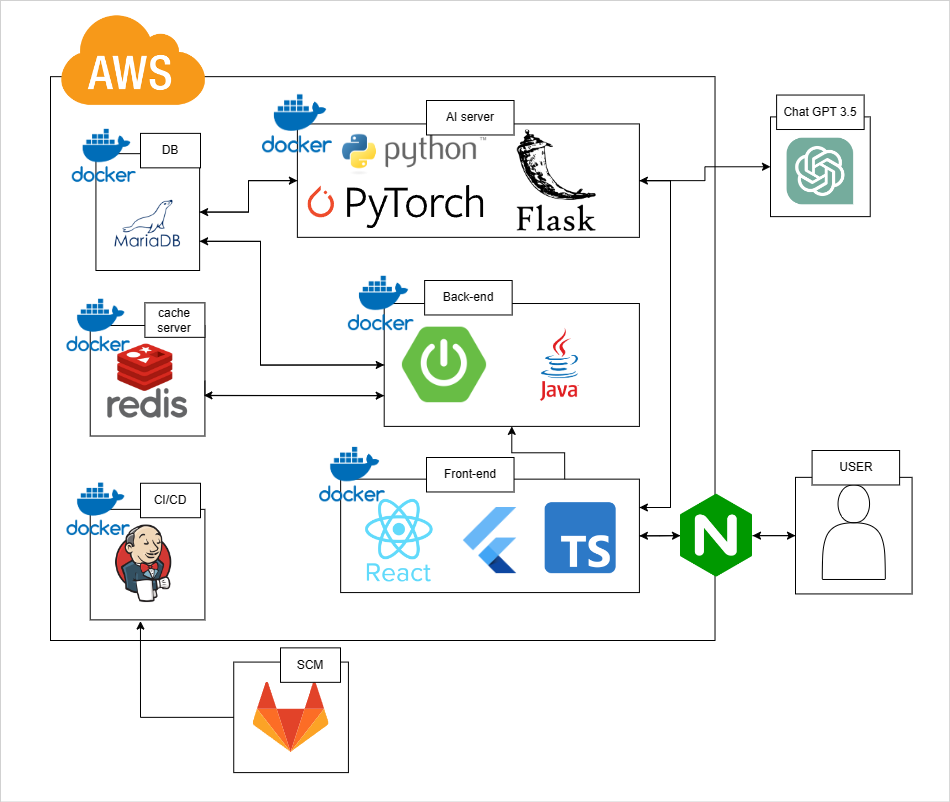
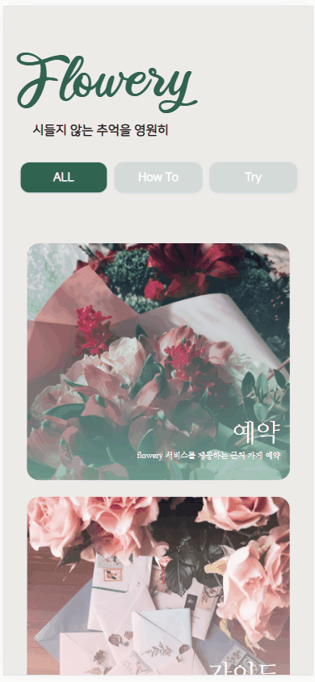
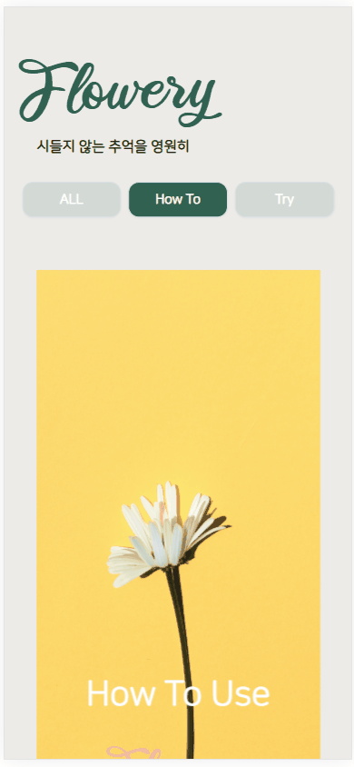
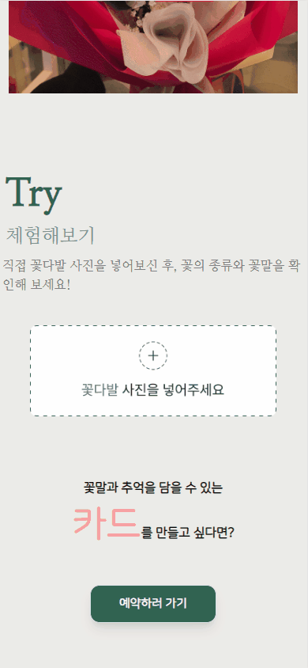
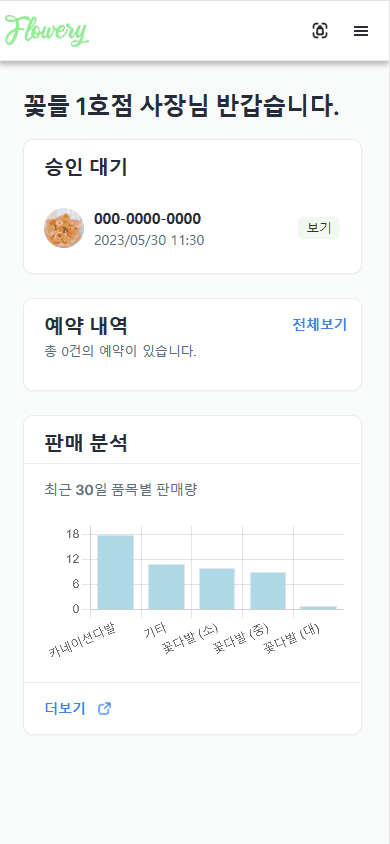
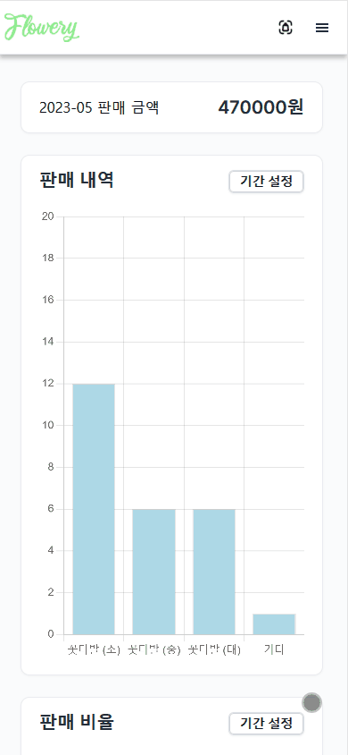
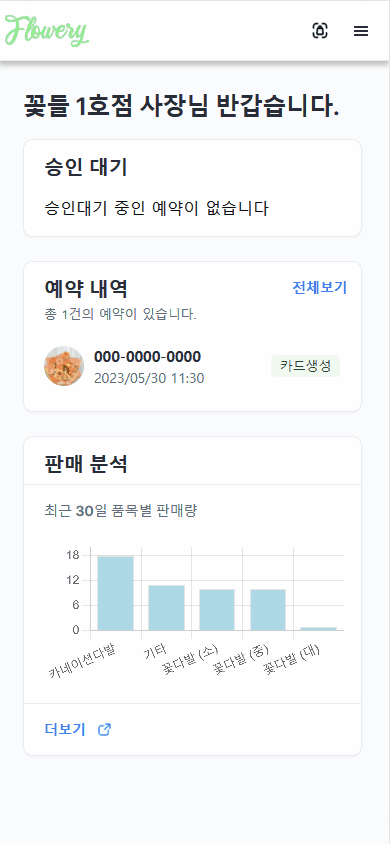
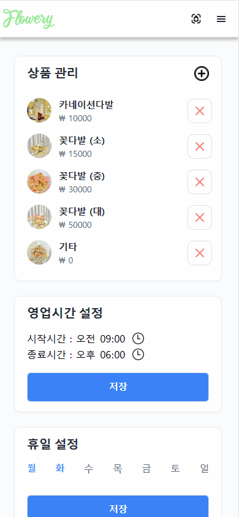
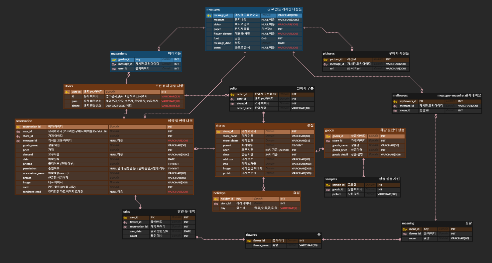

# Flowery 소개

**꽃은 시들어도 Flowery는 영원히**

`Flowery`는 꽃집을 대상으로 AI, 모바일 웹을 이용한 판매자 및 구매자를 위한 새로운 서비스를 제공하는 프로젝트입니다.

구매자 입장에서는 배달의 민족과 같이 꽃집 소개, 예약, 꽃에 메시지를 담아 QR코드로 저장하여 꽃과 동봉되는 카드를 통해 추억을 기억할 수 있습니다.
판매자 입장으로는 꽃다발을 제작 후 AI를 이용한 다중 객체 인식으로 꽃의 개수, 종류를 구분하여 판매 기록 관리 등의 서비스를 제공합니다.

## 0️⃣ 프로젝트 실천 및 기획 배경

### 기획배경
>**꽃집은 매우 불규칙적인 판매 구조를 가지고 있어서 IT 기술을 접목하기 어렵습니다.**
>
>**실제로 IT 솔루션이 많이 진출하지 않은 분야고 그렇기에 반대로 가능성이 있는 시장이라고 판단 하여 프로젝트를 진행하였습니다.**

### 프로젝트 실천
>**해당 프로젝트는 기획 과정에서 부산 서면, 양산에 위치한 꽃집의 사장님, 직원 분들과 3차례의 인터뷰를 통해 개선점 및 수요를 조사하여 서비스를 기획하였습니다.**
>
>**실제로 부산 강서구 삼성 전기 및 서면에 위치한 꽃집에서 각각 6시간 서비스 제공하였고 구글폼을 이용한 피드백을 바탕으로 기능을 수정하였습니다.**

## 1️⃣ 프로젝트 정보

### 프로젝트 목표
⭐ 실제 꽃집의 서비스적 수요와 요구사항을 조사하여 새로운 서비스를 구축하기

⭐ 서비스를 **실현**시켜 실제 꽃가게에서 서비스 제공하기

### 프로젝트 기간 4.10(월) ~ 5.19(금) (6주)

### 프로젝트 참여 인원

| 팀원명 | 담당 포지션  |
| --- | --- |
| 하상재 | BE |
| 고영일 | BE |
| 정인모 | BE |
| 최창근 | FE |
| 이승민 | FE |
| 배우찬 | FE |

## 🖥️ 시스템 아키텍쳐

## 🛠️ 사용된 도구

 
 

 
 

## ⚙️ 사용된 기술

**[ BACK END ]**

- **Spring Boot** : Run WIth Me Project의 전반적인 Rest Controller 구현.

- **Spring Security** : WebSecurityConfigurerAdapter를 상속받아 Filter를 적용, 사용자 권한에 맞는 기능을 수행하도록 구현.

- **JWT** : JSON Web Token을 활용하여 회원 인증 및 안정성있는 정보 교환을 할 수 있도록 활용.

- JPA (Hibernate)

  : ORM인 Hibernate를 활용하여 객체 중심의 개발을 할 수 있도록 하였고, SQL을 직접 작성하지 않고 Entity 필드가 되는 객체를 통해 DB를 동작시켜 유지보수에 용이하게 활용.

  - 동일한 쿼리에 대한 캐시 기능을 사용하기 때문에 높은 효율성 기대

- SSL 프로토콜

  : SSL을 적용하여 전송되는 패킷값을 암호화하여 외부의 공격자로부터 데이터를 보안하기 위해 사용.

  - **Let’s Encrypt** 무료 인증서를 발급받아 웹서버에 SSL 인증서를 적용.

- **Maria DB** : RDBMS로 구매자, 판매자, 꽃과 카드 등 필요한 데이터를 저장.

- **Redis**

  : 비관계형 데이터베이스로 'Key-Value' 구조 데이터 관리 시스템이며, 데이터를 메모리에 저장하여 빠른 처리속도가 필요한 기능에 적용.

  - 전화번호 인증을 위한 초단기간 저장을 위해 사용.

  - 만료일을 저장하면 만료 시 자동으로 데이터가 사라지는 특성을 활용하여 로그아웃된 토큰을 저장하여 블랙리스트로 활용.

- **AWS**

  - EC2 서비스를 이용하여 Ubuntu 서버를 구축 (호스팅).
  - S3 서비스를 이용하여 사진 및 영상을 저장하기 위해 사용.

- **Nginx**

  - EC2 서버의 내부 포트를 Front-End, Back-End, Flask, DB, Redis가 각각 작동할 수 있도록 포트를 구분

## 구매자 페이지

### 메인 페이지

### 이미지 객체 인식 체험 기능

### 예약 기능

### 메시지 작성

### 메시지 확인 페이지

## 판매자 페이지

### 판매자 메인페이지, 예약 수락, 거절 기능

### 판매 내역 확인

### 꽃다발 이미지 인식 및 카드 제작

### 판매 상품 관리

## ERD

